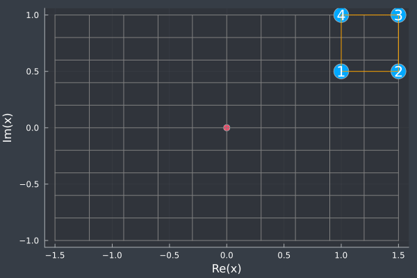
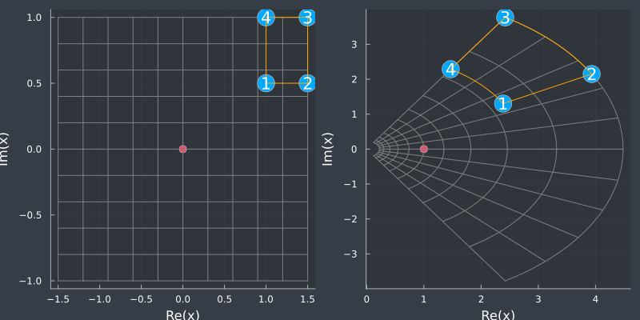
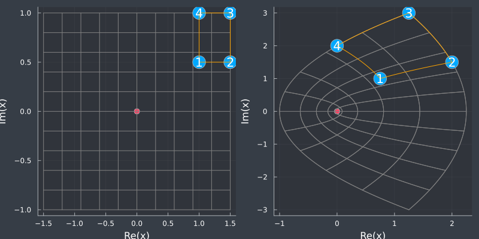

# Algunos experimentos con variables complejas

## Resumen

*Mapa 1*

$f(z) = \exp(z)$

*Mapa 2*

$f(z) = z^2$

---
## Contacto

Alejandro Garcés Ruiz
(https://github.com/alejandrogarces)

## Licencia

