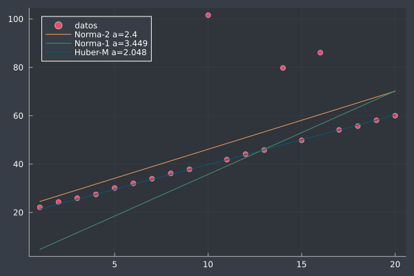

# Ejemplo simple de ajuste de curvas con diferentes funciones de costo

## Resumen

Minimos cuadrados convencional
$\ell = \frac{1}{2} (r)^2 $

Valor absoluto
$\ell = |r| $

Funcion de Huber (aproximada)
$\ell = \delta^2(\sqrt{1+(r/\delta)^2}-1)$

## Contacto

Alejandro Garcés Ruiz
(https://github.com/alejandrogarces)

## Licencia

