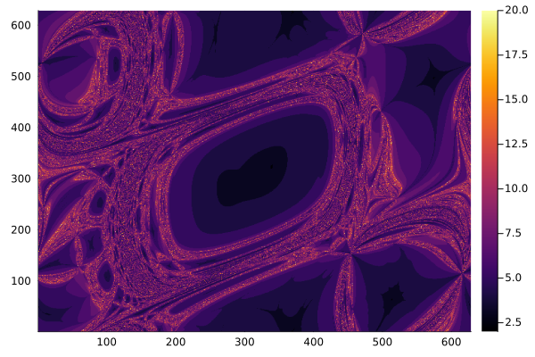

# Comportamiento fractal del flujo de carga

## Resumen

Este codigo muestra el comportamiento fractal del flujo de carga y la importancia de establecer condiciones formales de convergencia.  El sistema no-lineal de ecuaciones es el siguiente:

$h_1(\theta_{2},\theta_{3}) = 0.4923 - 0.3978\cos(\theta_{2})-1.888\sin(\theta_{2})-0.2439\cos(\theta_{23})-2.0154\sin(\theta_{23})$

$h_2(\theta_{2},\theta_{3}) = 3.9234 - 1.6390\cos(\theta_{3})-7.269\sin(\theta_3)-0.2439\cos(\theta_{23})+2.0154\sin(\theta_{23})$

Basado en el sistema de prueba de

* J. S. Thorp and S. A. Naqavi,"Load flow fractals,
  " Proceedings of the 28th IEEE Conference on Decision and Control,
  Tampa, FL, USA, 1989, pp. 1822-1827 vol.2,doi: 10.1109/CDC.1989.70472. *

---
## Contacto

Alejandro Garcés Ruiz
(https://github.com/alejandrogarces)

## Licencia

