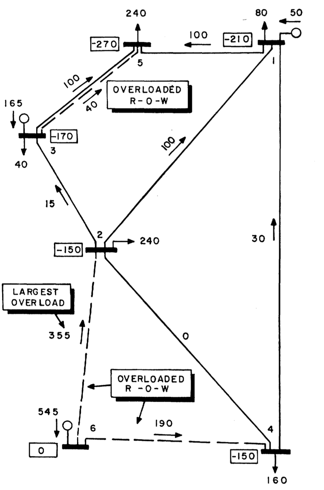

# Planeación de la transmision

## Resumen
Modelo de programación lineal para la planeación de la transmisión basado en el sistema Garver.  

*L. L. Garver, "Transmission Network Estimation Using Linear Programming," in IEEE Transactions on Power Apparatus and Systems, vol. PAS-89, no. 7, pp. 1688-1697, Sept. 1970, doi: 10.1109/TPAS.1970.292825.*

Se cuenta con la información de las líneas incluyendo costos.  Las líneas existentes tienen costo cero El modelo es de programación lineal entera mixta, a saber:

## Modelo de optimización:

Variables de decision:
* $p_k$ flujo por la linea $k=(i,j)$
* $z_k$ variable binaria indicando si la línea existe
* $\theta_i$ angulo en el nodo $i$

$\min \sum_k c_kz_k$

sujeto a

$|\theta_{ij}|\leq \pi/2$

$|p_k|\leq z_kp_k^\text{max}$

$|x_k p_k - \theta_{ij}| \leq (1-z_k)\pi$

$[A_{ik}][p_k] = [s_i]$

La última restriccion es matricial, en donde $A$ es la matriz de incidencia.  Note que cuando $z_k=1$ se activa tanto la restriccion de potencia maxima, como la ecuación de flujo DC.  En caso contrario, $p_k=0$ y $\theta_{km}$ queda libre, aunque desde luego no puede tomar un valor por fuera del rango $[-\pi/2,\pi/2]$.

## Datos de entrada

Los datos de entrada son dos archivos:

    data_lines.csv 
    data_nodes.csv

---
## Contacto

Alejandro Garcés Ruiz
(https://github.com/alejandrogarces)

## Licencia

El primero contiene los datos de las líneas.  Pueden existir varias lineas en un mismo corredor, por tanto, se repite el dato las veces que se permitan las líneas en dicho corredor.  Los datos nodales son basicamente potencia nodal.  Se divide por una base de 100 MW.

